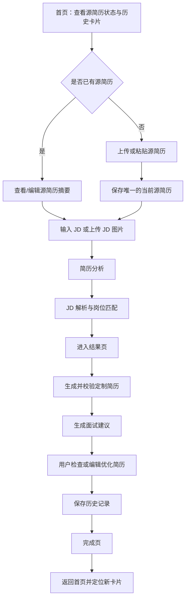
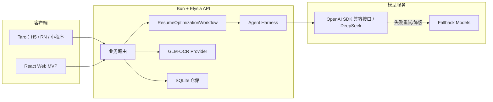

# Reffo 项目与产品说明

> [!summary]
> Reffo 是一个面向求职者的 AI 简历优化产品。它以用户的真实源简历为事实底座，结合目标岗位 JD，完成简历分析、岗位匹配、定向重写和面试准备，最终形成“一岗一简历”的求职材料。

## 1. 一句话定义

**输入一份真实源简历和一个目标岗位，输出一份更匹配该岗位、但不虚构候选人经历的定制简历及面试建议。**

## 2. 产品定位

| 维度 | 定义 |
| --- | --- |
| 产品名称 | Reffo |
| 产品类别 | AI 求职辅助 / 简历优化 |
| 核心用户 | 社招职场人士 |
| 次要用户 | 应届毕业生 |
| 核心场景 | 用户针对不同 JD 准备不同版本的投递简历 |
| 核心价值 | 提高简历与岗位的相关性、证据清晰度和可投递性 |
| 核心策略 | 一岗一简历、证据优先、事实安全 |
| 当前阶段 | MVP 主链路已产品化扩展，多端客户端与 Agent 工程仍在迭代 |

### 2.1 用户问题

求职者通常只有一份通用简历，但不同岗位关注的能力、经历和关键词不同。手工为每个岗位重排内容成本高，而且容易出现两类问题：

- 真实经历没有被放到招聘方最关注的位置。
- 为追求“匹配”而过度包装，造成事实升级或面试不可自证。

Reffo 的目标不是替用户编造一份更强的履历，而是从已有事实中选择、排序和表达最有说服力的证据。

### 2.2 核心产品原则

1. **一岗一简历**：每个目标岗位对应一份独立优化结果。
2. **事实优先**：公司、岗位、项目、技能、数字、日期和成果必须能回溯到源简历。
3. **差距不等于缺陷**：材料未证明某项能力，不等于候选人现实中不具备。
4. **重排优先于补写**：优先前置相关经历、压缩弱相关内容、对齐岗位语言。
5. **输出质量与申请材料分离**：作品集、证书、测试题等产品外材料缺口，不应直接判定简历不可交付。
6. **用户最终确认**：AI 生成内容需要用户复核后再投递。

## 3. 用户与任务

### 3.1 核心用户画像

| 用户 | 典型状态 | 主要需求 |
| --- | --- | --- |
| 社招求职者 | 有较完整经历，同时投递多个岗位 | 快速生成岗位定制版简历 |
| 转岗求职者 | 直接经验不足，但存在可迁移能力 | 找到可证明的能力映射，避免被简单判定为“不匹配” |
| 应届毕业生 | 工作经历较少，项目和实习是主要证据 | 把项目、实习和技能组织成可投递材料 |

### 3.2 Jobs To Be Done

- 当我看到一个目标岗位时，我希望快速知道自己与岗位的真实匹配程度。
- 当我的经历很多时，我希望系统帮我选择最相关的内容，而不是平均展示所有经历。
- 当我缺少某些显性关键词时，我希望系统识别已有的等价证据。
- 当我拿到优化结果时，我希望继续准备可能被问到的面试问题和项目故事。
- 当我投递多个岗位时，我希望能保存、查看并复用每次生成的结果。

## 4. 当前用户旅程



### 4.1 首页

- 展示品牌主张、当前源简历状态和历史生成卡片。
- 有历史记录时，使用卡片堆展示不同岗位的定制简历。
- 没有真实历史时，界面会使用演示卡片维持展示效果。
- 点击历史卡片可进入结果详情。
- 创建新简历时，如果已有源简历，可直接进入 JD 步骤。

### 4.2 创建页

创建流程包含三个状态：

1. **编辑源简历**
   - 支持直接编辑 Markdown。
   - `.md` / `.txt` 在前端读取。
   - `.pdf` 通过后端 GLM-OCR 转换为 Markdown。
   - 界面接受列表包含 `.doc` / `.docx`，但当前实现会提示暂不支持解析。
   - 单文件上限为 10 MB。
2. **源简历摘要**
   - 展示当前源简历标题、来源、更新时间和内容摘要。
   - 支持编辑或删除后重新上传。
3. **新的申请**
   - 支持手工输入 JD。
   - 支持上传 PNG/JPG/JPEG 岗位截图，经 OCR 后回填公司名、岗位名和 JD 文本。
   - OCR 结果可继续编辑。

创建页会先完成简历分析和岗位匹配，再保存一个可续跑的结果会话并进入结果页。

### 4.3 结果页

结果页继续执行剩余链路：

- 展示原始简历评级、差距分析和优化策略。
- 生成岗位定制版 Markdown 简历。
- 展示并允许编辑优化后的简历内容。
- 生成面试问题、项目故事建议和追问建议。
- 所有阶段完成后允许保存或进入完成页。

### 4.4 完成页

- 展示新生成的岗位卡片。
- 用户点击继续或等待 10 秒后返回首页。
- 首页通过新历史记录 ID 将对应卡片定位到卡片堆中。

## 5. 功能地图与成熟度

状态口径：

- **已实现**：当前源码存在完整主链路。
- **部分实现**：已有接口或 UI，但兼容性、运行状态或平台覆盖不完整。
- **规划中**：存在需求或配置设计，尚未形成闭环。

| 能力域 | 功能 | 状态 | 备注 |
| --- | --- | --- | --- |
| 输入 | Markdown/TXT 简历 | 已实现 | 前端直接读取 |
| 输入 | PDF 简历 OCR | 已实现 | 依赖 GLM-OCR 配置 |
| 输入 | DOC/DOCX 简历解析 | 部分实现 | UI 接受，处理逻辑当前明确拒绝 |
| 输入 | JD 文本输入 | 已实现 | 公司名、岗位名可单独维护 |
| 输入 | JD 图片 OCR | 已实现 | PNG/JPG/JPEG，解析后可编辑 |
| AI | 简历质量分析 | 已实现 | 输出评分、优劣势、建议、能力总结和结构化简历 |
| AI | JD 结构化解析 | 已实现 | 区分硬要求、职责、任务、加分项和上下文假设 |
| AI | 岗位匹配 | 已实现 | 输出匹配分、技能差距、优势、弱项和定位策略 |
| AI | 定制简历生成 | 已实现 | Markdown 输出 |
| AI | 简历质量校验与修订 | 已实现但当前分支不可完整运行 | 规则门禁、最多两轮修订 |
| AI | 面试建议 | 已实现 | 问题、故事建议、追问 |
| 结果 | 用户编辑优化简历 | 已实现 | 修改后写回最近结果会话 |
| 历史 | 岗位简历历史卡片 | 已实现 | 后端 SQLite + 前端本地缓存 |
| 源简历 | 当前源简历维护 | 已实现 | 当前只保留一份源简历 |
| 账号 | 登录、鉴权、用户隔离 | 规划中 | 有环境变量约束，无实际认证中间件 |
| 数据 | Supabase 生产存储 | 规划中 | 配置已定义，仓储仍直接使用 SQLite |
| 输出 | PDF/DOCX 导出 | 规划中 | 当前只有界面入口/需求描述，未形成可靠导出链路 |
| 平台 | Taro H5 | 已实现 | 当前主要 Web 产品入口 |
| 平台 | React Native Android/iOS | 部分实现 | 有原生工程和构建脚本，需按设备单独验证 |
| 平台 | 小程序 | 部分实现 | 有构建脚本，实际产品适配状态未确认 |
| 兼容 | 轻量 Web MVP | 已实现 | 仍可调用 `/mvp/process` 验证全流程 |

## 6. 信息架构

### 6.1 Taro 主客户端

| 页面 | 路由 | 职责 |
| --- | --- | --- |
| 首页 | `/pages/index/index` | 品牌入口、源简历状态、历史卡片、创建入口 |
| 创建页 | `/pages/create/index` | 源简历上传/维护、JD 输入、分析与匹配 |
| 结果页 | `/pages/result/index` | 续跑生成、展示分析、编辑简历、面试建议、保存 |
| 完成页 | `/pages/complete/index` | 生成完成反馈、返回首页 |

### 6.2 轻量 Web MVP

`frontend/Web/` 是一个单页三步流程：

1. 输入 Markdown 简历。
2. 输入 JD。
3. 调用完整流程接口并展示分析、匹配和优化简历。

它结构简单、与 `/api/v1/mvp/process` 直接对接，适合做后端主链路验证；它不是当前主要产品界面。

## 7. 系统架构



### 7.1 技术栈

| 层 | 技术 |
| --- | --- |
| 后端运行时 | Bun |
| 后端框架 | Elysia + TypeScript strict |
| API 文档 | Swagger |
| AI 调用 | OpenAI SDK 兼容接口，默认 DeepSeek |
| Schema | Zod + Elysia `t.Object` |
| 本地数据库 | `bun:sqlite` |
| OCR | GLM-OCR |
| 主前端 | Taro 4.1.9 + React 18 + TypeScript |
| 状态管理 | Zustand 5 |
| 样式 | Sass/SCSS |
| 高级视觉 | Three.js，按视觉等级降级 |
| 移动端 | React Native 0.73 / Expo 50 相关能力 |
| 轻量 Web | React 18 + Vite 5 + CSS |
| 测试 | Bun Test、Jest、Testing Library |

## 8. AI 工作流

### 8.1 完整流程

`POST /api/v1/mvp/process` 的目标流程是：

1. **Resume Analyzer**
   - 从源简历提取个人信息、教育、经历、项目和技能。
   - 输出质量评分、优势、弱点、建议和能力总结。
2. **JD Parser**
   - 提取岗位名称、公司、地点、硬要求、职责、任务和加分项。
   - 将 JD 明示事实、语义归纳、上下文假设和未知项分层。
3. **Matching Agent**
   - 计算匹配分。
   - 区分直接缺失、隐式证据和措辞差距。
   - 形成岗位定位策略和可执行的重排建议。
4. **Resume Generator**
   - 根据相关性重排简历。
   - 对齐 JD 语言，但不新增源简历不存在的事实。
5. **Quality Gate / Resume Revision**
   - 检查章节、长度、占位符和事实完整性等规则。
   - 未通过时最多执行两轮修订与重新校验。
   - 无法完全恢复时可返回 `partial` 和可恢复错误。
6. **Interview Advisor**
   - 生成面试问题、故事建议和追问问题。
7. **可选 LLM Judge**
   - 用于进一步质量评估，不默认阻塞主链路。

### 8.2 Harness 能力

后端不再只是简单的 Prompt 串联，已经引入以下工程机制：

- `run / step / attempt` 运行上下文。
- step 超时和整体 workflow 超时。
- Provider 瞬时错误识别与同模型有限重试。
- fallback model。
- JSON 解析和 schema 修复。
- 业务结果校验。
- 简历质量门禁与局部修订。
- 事件总线、trace、评估结果和摘要持久化。
- 失败样本回流、回归数据集和指标查询接口。

### 8.3 当前生产提示词口径

代码和评审材料将当前提示词标记为 `scope-aware-v4.2 / 4.2.1`。其主要约束包括：

- 事实必须可回溯。
- 数字、单位、时间、归属和“约/超过/至少”等限定词不可拆分。
- 不根据任职日期自行计算工作年限。
- 不把 JD 中出现的技能写成候选人已经具备。
- 不把上下文推断写成公司事实或候选人事实。
- 允许积极重排和压缩，但不允许语义升级。

> [!warning]
> 当前检出版本缺少 `backend/src/prompts/v42-prompts.ts`，因此上述提示词版本在此工作树中无法完整编译。评审结论应视为版本材料记录，不等同于当前检出代码已经可运行。

## 9. 核心数据模型

### 9.1 源简历

当前后端只保留一份“最新源简历”。保存新记录时会清空旧记录。

关键字段：

- `id`
- `title`
- `resume_markdown`
- `source_type: manual | file`
- `original_file_name`
- `created_at`
- `updated_at`

### 9.2 简历分析

- `quality_score`
- `strengths`
- `weaknesses`
- `suggestions`
- `capability_summary`
- `structured_resume`

### 9.3 岗位匹配

- `match_score`
- `hard_requirements_match`
- `skill_match`
- `experience_match`
- `strengths`
- `weaknesses`
- `weakness_details`
- `positioning_strategy`
- `optimization_suggestions`
- `context_fit`
- `jd_structure`

### 9.4 生成历史

历史记录既是首页卡片数据，也是结果页恢复快照。

关键字段：

- 岗位、公司、候选人姓名和创建时间。
- 简历质量分、岗位匹配分和技能标签。
- 原简历、JD、优化简历。
- 优化建议和改写摘要。
- 完整 `process_result`。
- 结果上下文与阶段进度。
- 卡片颜色和图案。

历史 ID 形如 `JDYYYYMMDD00001`。

## 10. 数据流与持久化

| 数据 | 后端 | 前端 |
| --- | --- | --- |
| 当前源简历 | SQLite `source_resumes` | `latest_source_resume` 本地缓存 |
| 生成历史 | SQLite `resume_histories` | `resume_histories` 本地缓存与离线回退 |
| 最近结果会话 | 未单独持久化 | `latest_result_session` |
| 简历/JD 编辑态 | 未持久化 | Zustand + 跨平台 Storage |
| Harness 运行数据 | SQLite 表 | 不直接消费 |

历史记录采用“后端优先、本地缓存兜底”的策略：

- 加载时先展示本地缓存，再请求后端。
- 本地存在但后端缺失的历史会尝试回传。
- 远端保存失败时，生成结果仍可落到本地缓存。

## 11. API 目录

统一业务响应通常为：

```json
{
  "success": true,
  "data": {}
}
```

失败通常为：

```json
{
  "success": false,
  "error": {
    "code": "ERROR_CODE",
    "message": "面向用户或开发者的错误信息",
    "details": {}
  }
}
```

### 11.1 AI 主链路

| 方法 | 路径 | 用途 |
| --- | --- | --- |
| POST | `/api/v1/mvp/process` | 执行完整优化流程 |
| POST | `/api/v1/mvp/analyze` | 仅分析源简历 |
| POST | `/api/v1/mvp/match` | 解析 JD 并完成岗位匹配 |
| POST | `/api/v1/mvp/generate` | 生成并校验优化简历 |
| POST | `/api/v1/mvp/interview` | 生成面试建议 |
| GET | `/api/v1/mvp/health` | 健康检查 |

Taro 当前主流程使用分步接口；轻量 Web MVP 使用完整流程接口。

### 11.2 文件解析

| 方法 | 路径 | 用途 |
| --- | --- | --- |
| POST | `/api/v1/parse/resume-file` | 解析 PDF 简历 |
| POST | `/api/v1/parse/jd-image` | OCR 岗位图片 |

### 11.3 源简历与历史

| 方法 | 路径 | 用途 |
| --- | --- | --- |
| POST | `/api/v1/source-resume` | 保存并替换当前源简历 |
| GET | `/api/v1/source-resume/latest` | 获取当前源简历 |
| DELETE | `/api/v1/source-resume/:id` | 删除当前源简历 |
| GET | `/api/v1/resume-history` | 获取历史列表 |
| POST | `/api/v1/resume-history` | 保存历史 |
| GET | `/api/v1/resume-history/:id` | 获取历史详情 |
| PUT | `/api/v1/resume-history/:id` | 更新历史 |
| DELETE | `/api/v1/resume-history/:id` | 删除历史 |
| DELETE | `/api/v1/resume-history` | 清空历史 |

### 11.4 Harness 观测

| 方法 | 路径 | 用途 |
| --- | --- | --- |
| GET | `/api/v1/mvp/dashboard` | 查询运行和质量指标 |
| GET | `/api/v1/mvp/regression-dataset` | 导出失败/部分成功的回归数据摘要 |
| GET | `/api/v1/mvp/runs/:run_id` | 查询运行记录 |
| GET | `/api/v1/mvp/runs/:run_id/replay` | 读取可重放事件流 |
| POST | `/api/v1/mvp/runs/:run_id/failure-samples` | 将运行回流为失败样本 |

Swagger 默认位于 `http://localhost:3000/swagger`。

## 12. 非功能性要求

### 12.1 隐私与安全

简历包含高敏感个人信息，产品目标要求：

- 传输加密。
- 用户身份与数据隔离。
- 可删除。
- 日志不记录完整简历、JD、Prompt 或模型原文。
- 持久化内容需要明确保留周期、脱敏和访问权限。

当前实现与目标之间仍有差距：

- 后端尚未接入真实登录与鉴权中间件。
- SQLite 数据没有用户维度隔离。
- 前端开发日志会记录 API 请求 `data`，可能包含完整简历和 JD。
- Supabase、生产环境和认证配置已定义，但仓储实现尚未切换。

### 12.2 可靠性

- AI 结构化输出使用 Zod 校验和修复。
- Provider 瞬时错误有有限重试和模型降级。
- 每个恢复动作都有次数和超时预算。
- 生成简历需要通过规则质量门禁。
- 前端历史数据支持远端失败时本地回退。

### 12.3 多端与性能

- Taro 共享代码优先使用跨端组件和平台适配层。
- H5 样式按 `393` 设计稿宽度执行 px transform。
- 视觉能力按 `basic / enhanced / premium` 分级。
- 高性能平台可使用 Three.js，低性能平台使用 CSS 降级。
- 动效优先使用 `transform` 和 `opacity`，并尊重 `prefers-reduced-motion`。

## 13. 当前项目结构

```text
reffo/
├── backend/                     # Bun + Elysia 后端
│   └── src/
│       ├── agents/              # 简历、JD、匹配、生成、修订、面试 Agent
│       ├── harness/             # 运行时、事件、评估、自愈与追踪
│       ├── prompts/             # 提示词
│       ├── providers/           # LLM Provider 与 fallback
│       ├── repositories/        # SQLite 仓储
│       ├── routes/              # API 路由
│       ├── schemas/             # Zod 输出契约
│       ├── services/ocr/        # GLM-OCR
│       └── workflows/           # 简历优化、OCR 工作流
├── frontend/
│   ├── Web/                     # 轻量 React MVP
│   └── Taro/reffo-taro/         # 当前主要多端客户端
├── doc/                         # 技术调研、流程图和演进说明
├── .kiro/specs/                 # 早期 PRD、技术设计与 Taro 需求
└── .codex/skills/               # 仓库级开发/验证技能
```

## 14. 当前状态判断

### 14.1 已形成的核心资产

- “一岗一简历”的明确价值主张。
- 从输入、匹配到生成和面试准备的完整产品旅程。
- 证据优先、禁止事实升级的提示词原则。
- 分步 API 与完整流程 API 并存。
- Taro 产品化页面、状态管理、跨端存储和错误处理基础设施。
- OCR 输入、源简历维护和历史卡片闭环。
- Agent Harness 的重试、修复、校验、追踪与回归基础。
- 提示词 A/B 与人工评审资料。

### 14.2 当前主要风险

1. **当前分支存在缺失模块**
   - `backend/src/harness/business-recovery.ts`
   - `backend/src/prompts/v42-prompts.ts`
   - 相关源码引用存在，但文件不在当前 Git 快照中。
2. **认证和生产数据层尚未落地**
   - `DATABASE_PROVIDER`、Supabase 和鉴权配置尚未接入实际仓储/路由。
3. **隐私日志风险**
   - Taro 开发模式 API 日志会打印请求数据。
4. **文件格式承诺不一致**
   - UI 接受 DOC/DOCX，但实际解析不支持。
5. **文档漂移**
   - 根 README 仍把前端启动目录写成 `frontend/`，实际项目是 `frontend/Web/` 或 `frontend/Taro/reffo-taro/`。
   - `backend/.env.example` 提到的 `dev:local`、`dev:nonprod`、`start:prod` 脚本未出现在当前 `backend/package.json`。
6. **多端完成度需要实机验证**
   - 存在 Android/iOS/小程序构建能力，不代表所有业务链路已经在每个平台验通。
7. **异步体验有限**
   - AI 流程仍以长请求和阶段续跑为主，没有真正的流式内容输出或后台任务队列。

### 14.3 本次静态核对结果

- 核对日期：2026-07-29。
- 分支：`private/reffo-hsl`。
- 提交：`a4dee85`。
- 后端单测命令：`bun test ./src`。
- 结果：16 个通过，3 个失败。
- 失败原因：上述两个缺失模块导致 3 个测试文件无法加载。
- 本次未执行真实 AI、OCR、H5、RN 或小程序端到端联调。

## 15. 建议路线图

### P0：恢复可运行基线

- 补回或正确合并缺失的 `business-recovery.ts` 和 `v42-prompts.ts`。
- 让后端单测和 TypeScript 检查恢复为全通过。
- 修正文档、环境脚本与实际 `package.json` 的偏差。

### P1：建立可信产品闭环

- 完成 Taro H5 的真实后端联调。
- 增加 PDF/OCR 成功与失败自动化测试。
- 统一 DOC/DOCX 的产品文案与实际能力。
- 移除或脱敏完整简历/JD 请求日志。
- 建立最小端到端样例与回归门槛。

### P2：生产数据与隐私

- 接入登录和用户身份。
- 抽象仓储接口，再将 SQLite 切换为 Supabase 或其他生产数据层。
- 按用户隔离源简历、历史和 Harness 数据。
- 定义删除、保留周期、审计和加密策略。

### P3：求职交付能力

- 增加 PDF/DOCX 导出与模板系统。
- 增加原简历与优化简历差异对比。
- 增加用户确认、事实核验和修改建议反馈。
- 评估异步任务、进度查询和流式结果展示。

### P4：质量增长

- 扩大独立留出集和跨行业回归集。
- 建立质量、事实安全、成本和延迟看板。
- 把用户接受/修改/删除的建议转化为可匿名评估信号。
- 评估投递后反馈闭环，但避免把不可控的招聘结果直接归因于单次简历生成。

## 16. 产品指标建议

当前仓库尚未实现完整埋点。后续可按四层指标设计：

| 层级 | 指标示例 |
| --- | --- |
| 激活 | 完成源简历录入率、完成首个 JD 输入率、首份结果生成率 |
| 交付 | 简历生成成功率、质量门禁通过率、平均修订次数、可恢复失败率 |
| 价值 | 用户保存率、优化简历编辑率、历史卡片复访率、用户自评可投递率 |
| 质量与成本 | 事实安全失败率、结构化解析失败率、单次成本、P50/P95 延迟 |

北极星指标可暂定为：**每周完成并保存的岗位定制简历数**。在具备可靠用户反馈后，再考虑加入“用户确认可投递”的质量条件。

## 17. 术语表

| 术语 | 含义 |
| --- | --- |
| 源简历 | 用户提供的真实基础简历，是所有候选人事实的主要来源 |
| JD | Job Description，目标岗位描述 |
| 一岗一简历 | 针对每一个岗位生成独立定制版本 |
| 结构化简历 | 从 Markdown 或 OCR 文本中提取的个人信息、经历、项目和技能数据 |
| 匹配分析 | 比较候选人证据与岗位要求后形成的评分和差距说明 |
| 事实升级 | 将“参与”写成“主导”、将行动写成无证据成果等超出源事实的改写 |
| Harness | 包裹 Agent 的运行时工程层，负责上下文、attempt、恢复、评估和追踪 |
| Quality Gate | 对生成结果执行的规则或模型质量门禁 |
| Result Session | 创建页与结果页之间用于续跑和恢复的最近结果快照 |
| `partial` | 主结果可返回，但存在非致命质量问题或可恢复错误 |

## 18. 关键文件索引

### 产品与流程

- [产品需求](../.kiro/specs/reffo/requirements.md)
- [MVP 范围](../.kiro/specs/mvp/requirement.md)
- [用户旅程与接口时序](用户旅程与接口时序.md)
- 本地未跟踪评审材料：`backend/data/prompt-ab/v4.2-human-report.md`

### 后端

- [服务入口](../backend/src/index.ts)
- [MVP 路由](../backend/src/routes/mvp.ts)
- [OCR 路由](../backend/src/routes/parse.ts)
- [源简历路由](../backend/src/routes/source-resume.ts)
- [历史路由](../backend/src/routes/resume-history.ts)
- [完整优化工作流](../backend/src/workflows/resume-optimization-workflow.ts)
- [领域类型](../backend/src/types/index.ts)
- [环境配置](../backend/src/config/env.ts)
- [SQLite 初始化](../backend/src/repositories/database.ts)

### Taro 主客户端

- [页面路由](../frontend/Taro/reffo-taro/src/app.config.ts)
- [首页模型](../frontend/Taro/reffo-taro/src/pages/index/model/usePageModel.ts)
- [创建页模型](../frontend/Taro/reffo-taro/src/pages/create/usePageModel.ts)
- [结果页模型](../frontend/Taro/reffo-taro/src/pages/result/usePageModel.ts)
- [完成页模型](../frontend/Taro/reffo-taro/src/pages/complete/usePageModel.ts)
- [简历 API](../frontend/Taro/reffo-taro/src/services/resume.ts)
- [OCR API](../frontend/Taro/reffo-taro/src/services/parse.ts)
- [历史 Store](../frontend/Taro/reffo-taro/src/store/historyStore.ts)
- [前端领域类型](../frontend/Taro/reffo-taro/src/types/index.ts)

### 轻量 Web MVP

- [Web 主页面](../frontend/Web/src/App.tsx)
- [Vite 代理配置](../frontend/Web/vite.config.ts)

## 19. 维护规则

更新本知识条目时，优先级如下：

1. 当前可运行源码和自动化测试结果。
2. 最近一次人工评审或真实联调记录。
3. 当前产品需求和设计文档。
4. 早期交付文档与历史计划。

若四者冲突，应在文档中同时标注“目标设计”和“当前实现”，不要用愿景替代现状。
