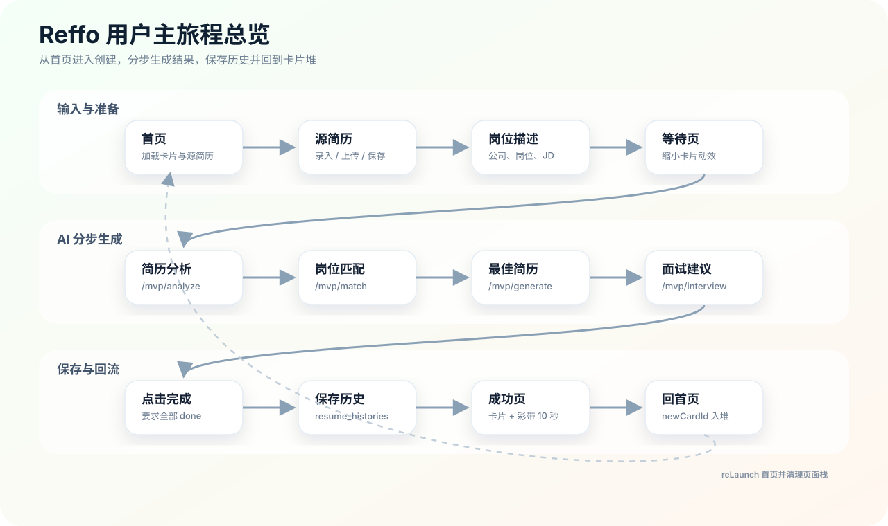
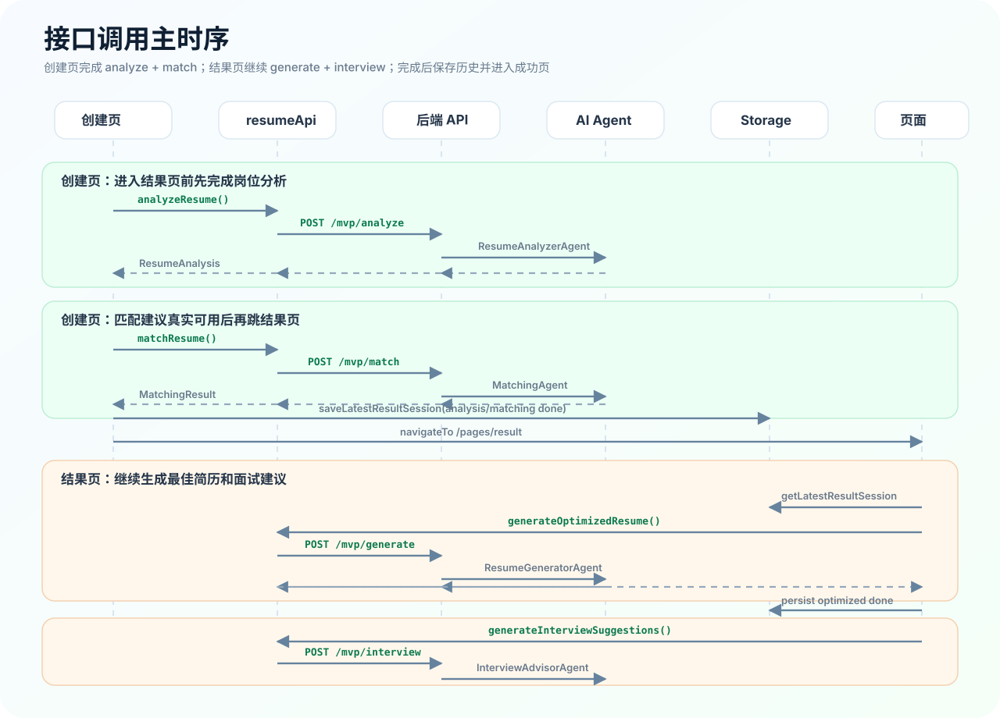
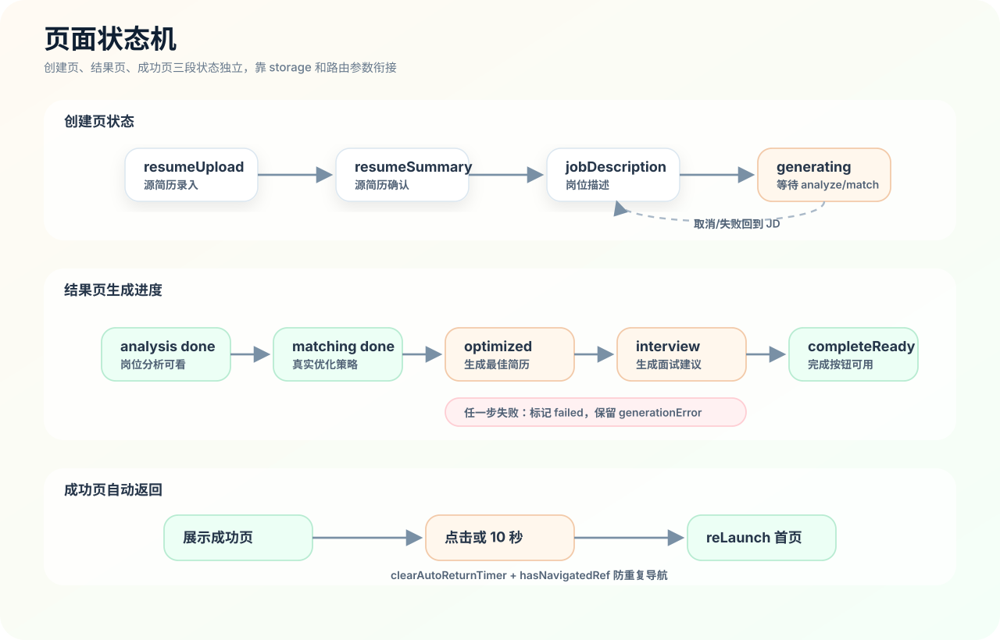
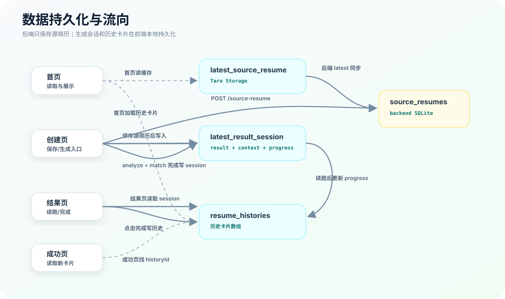
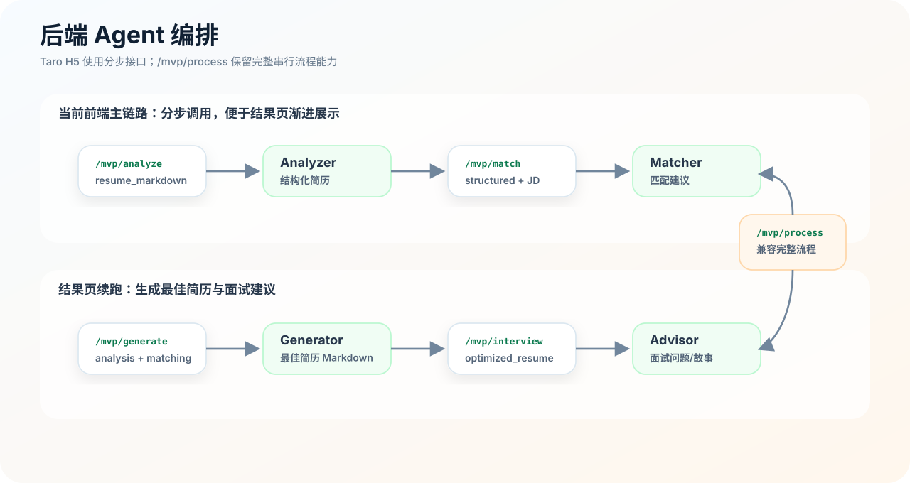

# Reffo 用户旅程与接口时序图谱

更新时间：2026-07-07

> 图片版项目资料。图都放在 `doc/assets/`，用手工 SVG 排版，避免 Mermaid 自动布局线条过长、交叉和页面过高的问题。

## 1. 用户主旅程总览

## 2. 接口调用主时序

## 3. 页面状态机

## 4. 数据持久化与流向

## 5. 后端 Agent 编排

## 6. 关键结论

- 主流程使用分步接口：创建页负责 `/mvp/analyze` 和 `/mvp/match`，结果页负责 `/mvp/generate` 和 `/mvp/interview`。
- 创建页跳结果页前已经拿到真实岗位匹配结果，所以岗位分析不需要先展示兜底建议。
- 结果页完成后写入前端本地 `resume_histories`，再进入成功页。
- 成功页点击或等待 10 秒后 `reLaunch` 回首页，并通过 `newCardId` 定位新卡片入堆。
- 后端 SQLite 只保存源简历；最近生成会话和历史卡片目前保存在前端 Taro Storage。

## 7. 文件索引

| 主题 | 文件 |
| --- | --- |
| 首页旅程 | `frontend/Taro/reffo-taro/src/pages/index/model/usePageModel.ts` |
| 创建页生成链路 | `frontend/Taro/reffo-taro/src/pages/create/usePageModel.ts` |
| 结果页续跑链路 | `frontend/Taro/reffo-taro/src/pages/result/usePageModel.ts` |
| 成功页自动返回 | `frontend/Taro/reffo-taro/src/pages/complete/usePageModel.ts` |
| 前端 API client | `frontend/Taro/reffo-taro/src/services/api.ts` |
| MVP API 封装 | `frontend/Taro/reffo-taro/src/services/resume.ts` |
| 源简历 API 封装 | `frontend/Taro/reffo-taro/src/services/sourceResume.ts` |
| 后端 AI 路由 | `backend/src/routes/mvp.ts` |
| 后端源简历路由 | `backend/src/routes/source-resume.ts` |
| 后端源简历仓储 | `backend/src/repositories/source-resume-repository.ts` |
